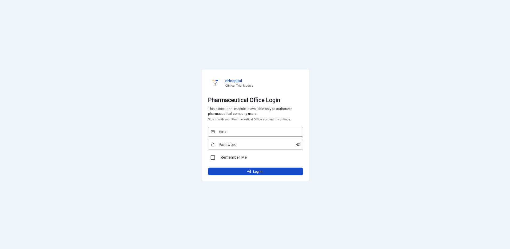
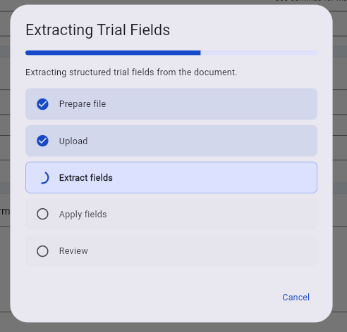
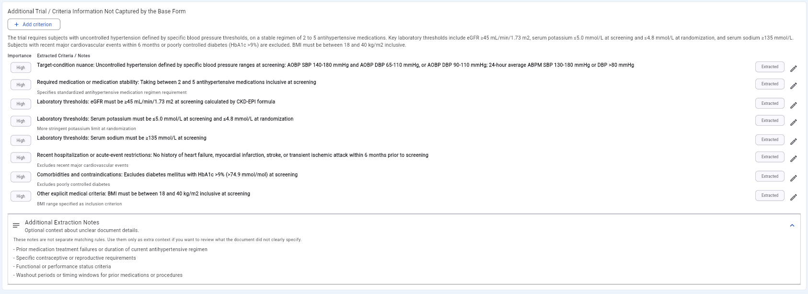
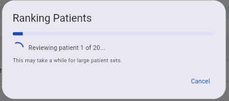
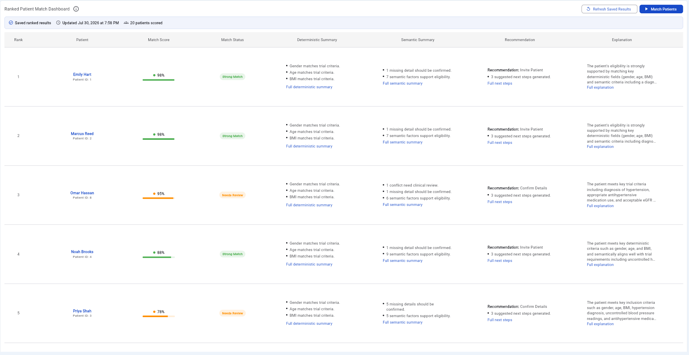

# 2026-summer-2--Agentic-AI-for-the-Clinical-Trial-Screening

Abdullah Al-Sharkawi - 300497453

William Young - 300395766

Melika Jahani - 300424243

---

## What this project is

A working proof of concept that adds an AI-assisted, multi-agent screening workflow on top of the existing e-Hospital clinical trials component.

The existing e-Hospital system already lets pharmaceutical users create trials, list them, view details, and match patients using hardcoded field comparisons. That deterministic matching handles objective criteria like age and gender well enough, but real trial documents carry eligibility requirements that never fit those fields: lab thresholds, medication stability windows, disease severity, prior treatment history. Those requirements get lost.

This POC closes that gap. A user uploads a trial PDF or DOCX, the system extracts the structured fields as well as the additional medical criteria the form cannot hold, then screens patients against both layers and returns a ranked list with a score, a status, an explanation, and a suggested next action for each patient.

The deterministic and AI layers stay visibly separate throughout. Objective checks remain rule-based, and nuanced clinical judgment goes to the semantic layer. AI reasoning supplements the hard exclusion rules and never silently overrides them.

## Walkthrough

The app is gated behind the existing e-Hospital pharmaceutical company login, which this project reuses rather than replacing.



Creating a trial starts with uploading its document. The backend parses the file and runs two extraction agents against it.



The first agent fills in the structured trial fields. The second pulls out the eligibility requirements that have nowhere to go on the standard form, categorises them, and rates how important each one is. Everything is presented for review before it is saved, and any criterion can be edited or added by hand.



Matching runs the full pipeline for each selected patient, which means two model calls per patient, so it runs in batches with progress shown.



The result is a ranked dashboard. Each row carries the match score, a status, the deterministic summary, the semantic summary, a recommended next step, and an explanation of how the score was reached. Deterministic and AI-derived information stay in separate columns so a reviewer can always see which is which.



**Status:** complete and running end to end against the TA-provided shared MySQL database. Trial creation, document extraction, criteria persistence, deterministic matching, the full ranked pipeline, and trial deletion have all been verified against it.

## How the screening works

Six stages, each with one clear input and output:

1. **Clinical Trial Document Field Extractor** reads the uploaded document and maps its content onto the existing e-Hospital trial fields (name, conditions, pathology, age range, gender, BMI, exclusions).
2. **Supplemental Criteria Interpretation Agent** pulls out the medically relevant requirements that do not fit those fields, and stores them separately so the original schema stays untouched.
3. **Deterministic matching** applies rule-based comparison to the objective criteria: gender, age, BMI, pregnancy. It returns which fields matched, failed, or were missing.
4. **Semantic Patient-Trial Comparison Agent** compares the supplemental criteria and free-text clinical fields against each patient's clinical record, producing per-criterion assessments. It deliberately does not score or recommend.
5. **Eligibility Scoring Agent** combines both layers into a 0-100 score and a status. This is an auditable formula rather than a model call, using weighted buckets: objective eligibility 25%, core clinical fit 35%, clinical exclusion safety 25%, additional criteria fit 15%. A confirmed hard exclusion caps the score in the 0-25 Not Eligible band so it cannot be averaged away.
6. **Explanation and Recommendation Agent** explains the score in reviewable language and suggests a next step, without restating it as a final medical decision.

Results are persisted, so reopening a trial reads saved results instead of re-running the pipeline.

One design note worth calling out: multi-value clinical text such as related conditions, disease exclusions, and medication exclusions is handled semantically rather than by exact string matching. Patient records and trial documents describe the same condition in different words, and exact matching on that text produced brittle, misleading results.

## Repository layout

```
flutter_frontend/     Flutter web frontend (built from scratch for this project)
backend_copy/         Node/Express backend, serves the API and contains all agent code
  app/services/agents/    the four AI agents
  app/services/           matching, scoring, explanation, persistence
  app/controllers/        clinicalTrialPocController.js, the POC endpoints
  local-dev/              database schema, sample data, config templates
project-context/      Design documentation (see below)
docs/screenshots/     Images used in this README
```

`backend_copy/` is a copy of [ottawa-ehospital/E-react-node-backend](https://github.com/ottawa-ehospital/E-react-node-backend), taken 2026-06-30. It is the live backend for this POC, not a reference copy. New functionality was added as isolated routes, controllers, and services rather than by rewriting existing files.

This POC was not merged into the e-Hospital backend. It runs as a standalone frontend and backend pair that integrates with the shared database.

## Setup

### Prerequisites

- Node.js 18 or newer, with npm
- Flutter SDK 3.x with web support enabled
- MySQL 8.0
- An OpenAI API key

### 1. Configuration files

Three files hold credentials. All three are gitignored and none are included in this repository, so you will need to create them locally.

```bash
cd backend_copy
cp local-dev/db.config.example.js app/config/db.config.js
cp local-dev/mongodb.config.example.js app/config/mongodb.config.js
```

**`backend_copy/app/config/db.config.js`** holds the MySQL connection. Replace the placeholders:

```js
module.exports = {
  HOST: "<YOUR_MYSQL_HOST>",       // "localhost" for local development
  USER: "<YOUR_MYSQL_USER>",       // "root" for a default local install
  PASSWORD: "<YOUR_MYSQL_PASSWORD>",
  DB: "<YOUR_DATABASE_NAME>",
  PORT: 3306,
  dialect: "mysql",
  pool: { max: 300, min: 0, acquire: 30000, idle: 10000 },
  timezone: "+00:00",
};
```

To run against the shared course database instead of a local one, put the host, user, password, and database name supplied by your TA here. Those values are not recorded anywhere in this repository. The shared database may have been rotated or retired since submission, so if you cannot reach it, use the local path below, which is self-contained.

**`backend_copy/.env`** holds server-side secrets. Create it from the template:

```bash
cp .env.example .env
```

Then set your own key:

```
OPENAI_API_KEY=<YOUR_OPENAI_API_KEY>
OPENAI_MODEL=gpt-4.1-mini
OPENAI_EXTRACTION_SEED=424242
```

The API key is used only on the server, through `process.env.OPENAI_API_KEY`. Do not put it in the Flutter app or any client-side code, since a web build ships to the browser.

A note on cost: ranked matching makes two OpenAI calls per patient. Running "Match All Patients" against a database of 130 patients is roughly 260 calls against your own key. Start with "Match Next 10 Patients" while you are finding your footing.

### 2. Database

For local development, build the database from the included schema and sample data:

```bash
mysql -u root -p < backend_copy/local-dev/schema.sql
mysql -u root -p < backend_copy/local-dev/seed.sql
```

This creates a synthetic database with sample patients, trials, and clinical records. No real patient data is involved. `schema.sql` also documents the exact table and column shapes the backend expects, which is useful when pointing the app at any other database.

Optional, for a focused matching demonstration:

```bash
mysql -u root -p < backend_copy/local-dev/trial-0021-demo-patients.sql
```

This replaces the sample patients with twenty built around one hypertension trial, which produces the spread of scores shown in the dashboard screenshot above.

The local sample login is `pharm1@test.com` / `pharm1`, type Pharma. This is synthetic data created by `seed.sql` rather than a real credential. Note that the inherited e-Hospital login path compares this password in plaintext, which is a limitation of the code this POC reuses and not a pattern to carry forward.

### 3. Run

Backend:

```bash
cd backend_copy
npm install
npm run dev
```

Frontend, in a second terminal:

```bash
cd flutter_frontend
flutter pub get
flutter run -d chrome --web-hostname localhost --web-port 3000 --dart-define=API_BASE_URL=http://localhost:8080
```

Sign in, then create a trial by uploading a document or entering it manually. Open the trial and use **Match Patients** to run the pipeline.

Four validation scripts check core logic without needing a database or an API key:

```bash
npm run validate:document-upload
npm run validate:extraction-consistency
npm run validate:matching-modes
npm run validate:trial-edit
```

## Known limitations and next steps

An honest accounting of what a future team would want to pick up.

**Patient clinical depth.** The semantic layer is only as good as the patient records it reads. The shared course database stores patient clinical data in `patients_pathology`, which carries pathology, surgeries, pregnancies, and prior medications, but no free-text medical history or clinical notes. Most trial documents screen on exactly what those fields do not hold: eGFR, HbA1c, serum potassium and sodium, blood pressure readings, medication counts, recent cardiovascular events. With that context absent, the semantic agent correctly returns "Missing" for most supplemental criteria, which pushes nearly every patient to "Needs Review" regardless of how well they otherwise fit.

This is the single biggest constraint on result quality. There are two directions worth trying: extend `patients_pathology` with `medical_history` and `other_notes` columns (the local schema includes both, and `semanticComparisonService.js` already reads them), or find and connect the populated tables where that clinical narrative actually lives. The shared database has `medical_history`, `family_history`, `surgical_history`, and `allergy_records` tables, but all four were empty at the time of submission.

**Keep a local synthetic database in the development loop.** Development and testing should target the local synthetic database, with the shared database used for integration checks rather than day-to-day work. One bug found late in this project only reproduced against the shared database and was invisible locally, because MySQL treats table-name case sensitivity differently on Windows and Linux. Testing in both places catches that class of problem early.

**Stale result detection.** Match results are cached per trial-patient pair, and editing a trial's eligibility criteria clears them. But `patient_context_hash` and `trial_criteria_hash` exist in the schema without being populated, so a result does not currently go stale when a patient's record changes. Filling those in would let the system re-screen only the pairs that actually need it.

**Two matching implementations.** `deterministicMatchingService.js` reimplements the rules from the inherited `userController.getSingleClinicalTrialsMatchedPatients` in a structured form, deliberately, to avoid modifying shared code. Both now exist, and unifying them would remove the duplication.

**Untested against the shared database.** The invite and application workflow endpoints, trial editing, trial status changes, and the "Refresh Saved Results" path have been exercised locally but not against the shared database.

**Deterministic summary detail.** The dashboard's deterministic bullets are generic per field ("Age matches trial criteria") rather than carrying the patient's value ("Age 52 is within the required 18-75 range"). The underlying service already returns the detail.

## Documentation

`project-context/` holds the design record, written as the project went:

| File | What it covers |
| --- | --- |
| `PROJECT_BRIEF.md` | Goals, scope, agent responsibilities, success criteria |
| `ARCHITECTURE.md` | System flow, the deterministic and semantic split, field-by-field matching map |
| `API_CONTRACT.md` | Every endpoint with request and response shapes |

### Additional documentation available on request

Several further documents are kept outside this public repository. They cover the shared database environment and its configuration, the full backend change record, the design decisions and the alternatives that were rejected, implementation history, and extended setup notes.

If you are picking this project up and would find them useful, email **williamrayyoung@gmail.com** and I will share them.

## Questions

If anything is unclear, whether that is the architecture, the scoring model, the database integration, or setting up an AI-assisted workflow against this codebase, email **williamrayyoung@gmail.com**. Happy to share additional context and working notes that did not make it into the repository.
